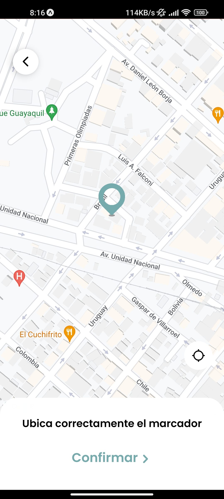
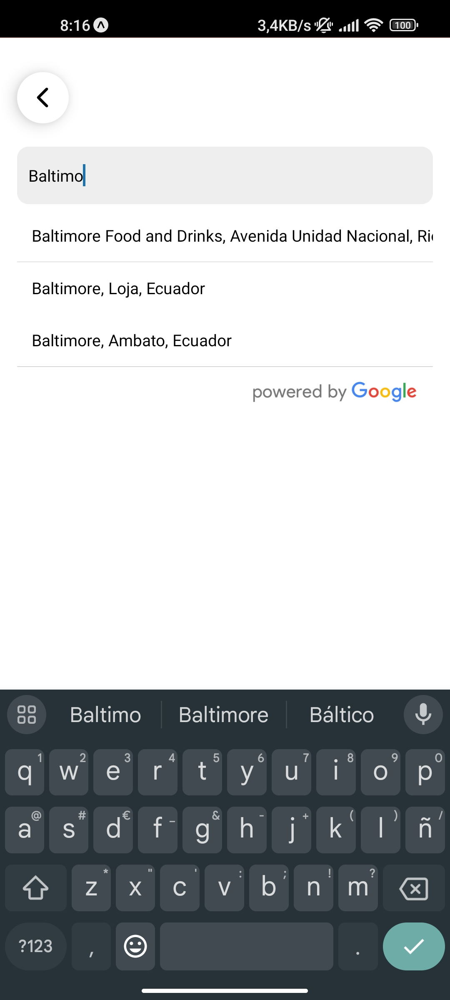
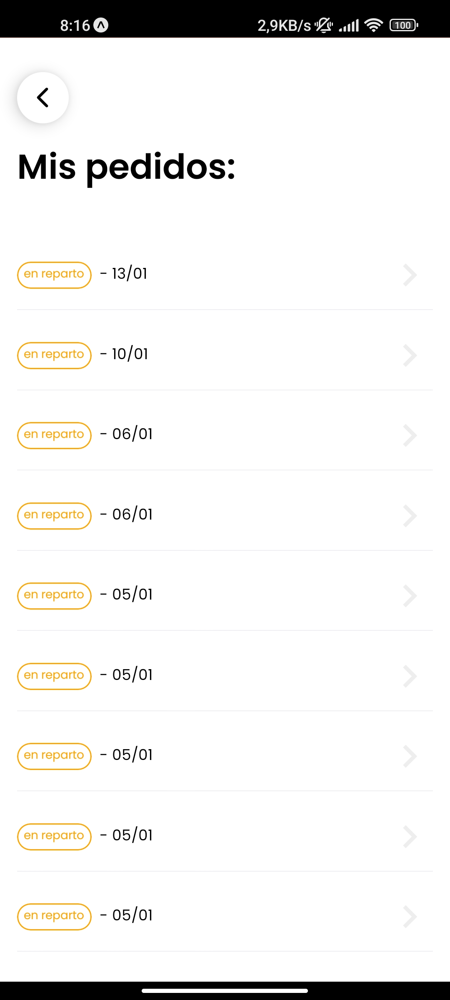
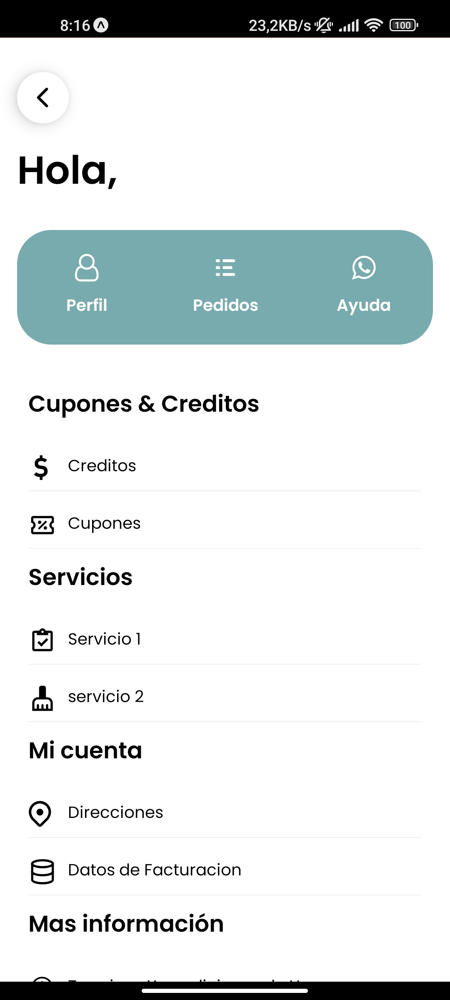
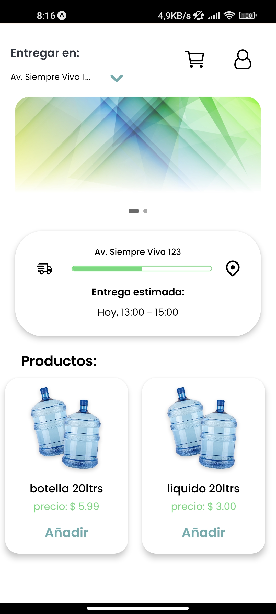

# Glup  

Glup es una aplicación ficticia diseñada para gestionar servicios de entrega de agua a domicilio. Este proyecto tiene fines educativos y demuestra cómo construir soluciones tecnológicas para este sector.

## 🚀 Características principales  

- Gestión de pedidos de agua: Simula la creación y seguimiento de pedidos.  
- Interfaz intuitiva: Diseñada para clientes, proveedores y conductores.  
- Cálculo de rutas simuladas: Optimización para entregas.  
- Notificaciones ficticias: Actualización del estado del pedido en tiempo real.  

## 🛠️ Tecnologías utilizadas  

- Frontend: React Native  
- Backend: Node.js (Express)  
- Base de datos: PostgreSQL  

## ⚙️ Instalación y uso  

1. Clona este repositorio:  
   ```bash
   git clone https://github.com/WALD3V/Glup.git
   cd glup
Diseño:
<p align="center">
  
  
  
  
  
</p>

